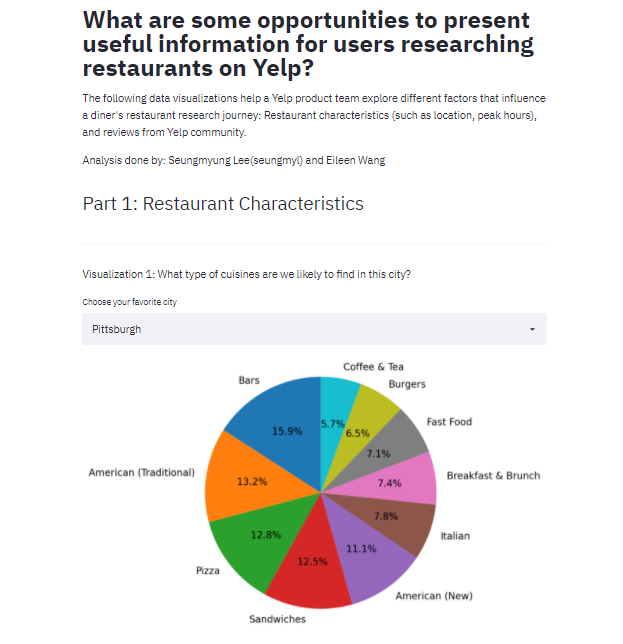

# Exploring new information to present to Yelp users
Find our Streamlit app here: https://share.streamlit.io/cmu-ids-2020/a3-randomly-generated-by-hand/
 

TODO: Short abstract describing the main goals and how you achieved them.

## Project Goals
To pose compelling questions and create effective visualizations, we thought it would be helpful to identify a target audience first. Our target audience is the product team at Yelp, and they would be interested in exploring questions like: “What are some opportunities to present useful information for users researching restaurants on Yelp?” There are many types of information a user comes across  in navigating their restaurant research. For this project, we decided to explore two kinds of information that are essential in users’ research journey: Restaurant characteristics and Yelp community reviews.

Restaurant characteristics:
The information that falls in this category describes the operational side of restaurants  and the kind of food they serve. When users start their research journey, they could be presented with a large quantity of options in a city. Considering different restaurant characteristics is a necessary step users take to narrow down on options and not feel overwhelmed. Below questions explores a few restaurant characteristics:
1. What type of cuisines are we likely to find in this city?
2. What are the peak hours of this restaurant in a given day?

Yelp community reviews:
Input from the Yelp community in the form of text reviews, star ratings, and upvotes also play a significant role in helping users navigate their restaurant search.  Below questions present opportunities for exploratory analyses, looking at their prominence over time and relationship to each other.
3. What words are most frequently used to describe different cuisine types?
4. How has user appreciation for “cool”, “useful”, and “funny” reviews changed over the years? 
5. Is there a relationship between adjectives reviewers use ( funny, cool, useful, etc.) and the star ratings they give to a restaurant? 

## Design

**Visualization 1: Drop down menu and pie chart to answer “What type of cuisines are we likely to find in this city?”:**
Currently on yelp.com, you can filter restaurants by different cuisine types in each city, but there isn’t a way to see an overall breakdown of cuisine types. Therefore, we created a drop down menu to select a city to focus on, and a pie chart to dig deeper into their cuisine breakdown. In this project we selected the top 5 cities with the most data on cuisine types for the drop down menu, as this is meant for the product team to find macro trends. Cities with little to no data on cuisine type would not reveal any insights. 

On the interaction technique front, first we considered using checkboxes for the viewer to select the city, but realized the viewer might be prompted to select multiple cities, and our pie chart is meant to showcase only one city at a time. Additionally, checkboxes present more of a cluttered view in the UI. The drop down menu is selected so that the product is led to only select one city at a time. 

Function wise, the drop-down menu is meant for the product team to toggle between different cities and quickly find any obvious similarities or differences between the cities. For example, it looks like through toggling the cities that Pizza as a cuisine type is fairly prominent in all 5 cities. 
The pie chart is our visualization choice to answer this question because it provides a glancible view of how available each cuisine type is in a given city. The larger the area, the higher chance a Yelp user might find a restaurant providing that specific cuisine type. Alternatively we thought of using a bar chart here, but it would not present how prevalent each part (cuisine) is within the whole (city). 

Our pie chart can help the product team understand how competitive a restaurant might be in a city, given how many other restaurants also serve the same cuisine. With this information, Yelp can potentially have a feature that tells users which restaurants are the most popular among x number of restaurants serving similar cuisine.

**Visualization 2: Drop down menu and bar chart to answer “What are the peak hours of this restaurant in a given day?”**
On yelp.com, currently there isn’t a way to browse restaurants by whether they are busy or not. Especially when users are under a time constraint, they may not want to go to a restaurant where they may be expected to wait a while for service. During the pandemic, users who are conscious of being in the same place with many other customers might also want to opt for a restaurant operating in an  off-peak time period. The product team can utilize this interactive bar graph to see if there is an opportunity to create a feature that highlights restaurants providing service quickly during a user’s research journey. 

The series of drop down menus work to filter information shown in the bar graph. They are designed to be used by the product team to examine how a restaurant’s peak hours differs during the week. As the peak hours and off-peak hours vary a lot considering different factors such as city, food, restaurant, and time of week, we thought a sequential filtering using a series of drop-down menu would help present the cleanest snapshot of a restaurant’s peak/off-peak hours. 

In the bar graph, the taller the bar is, the more customer check-ins there are at a given hour in the weekday. Off-peak hours are easy to sight for the viewer, as they are the times where there are little to no check-ins from customers (and therefore present gaps in the bar chart). 

As an alternative design solution to this question, we thought of combining the restaurant off-peak/peak hours of each city in one bar chart, where cities are identified by the color of their bars. However, we realized that this information is not very helpful from an aggregate point of view. Ultimately as the user researching restaurants you only need to know the off=peak/peak hours of the one restaurant you are going to. 

## Development

TODO: **An overview of your development process.** Describe how the work was split among the team members. Include a commentary on the development process, including answers to the following questions: Roughly how much time did you spend developing your application (in people-hours)? What aspects took the most time?
