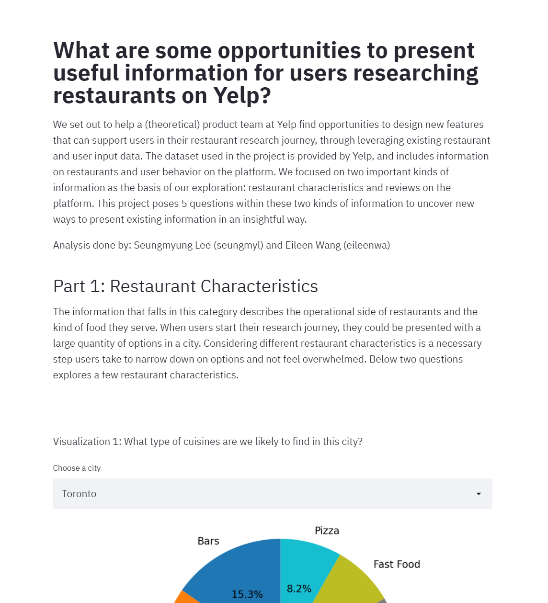

# Help Yelp product team find new opportunities to improve how users research restaurants
Find our Streamlit app here: https://share.streamlit.io/cmu-ids-2020/a3-randomly-generated-by-hand/
 

We set out to help a (theoretical) product team at Yelp find opportunities to design new features that can support users in their restaurant research journey, through leveraging existing restaurant and user input data. The dataset used in the project is provided by Yelp, and includes information on restaurants and user behavior on the platform. We focused on two important kinds of information as the basis of our exploration: restaurant characteristics and reviews on the platform. This project poses 5 questions within these two kinds of information to uncover new ways to present existing information in an insightful way. We used Python and several different libraries to create a series of visualizations to understand the shape and structure of the data itself. We also included interactive knobs for each visualization to explore different areas of the data presented. Through building and analyzing the visualizations we created, we think there is an opportunity to pursue new features in several areas such as showcasing restaurants that are not busy, and restaurants with many “cool” upvotes.    

## Project Goals
To pose compelling questions and create effective visualizations, we thought it would be helpful to identify a target audience first. Our target audience is the product team at Yelp, and they would be interested in exploring questions like: **“What are some opportunities to present useful information for users researching restaurants on Yelp?”** There are many types of information a user comes across  in navigating their restaurant research. For this project, we decided to explore two kinds of information that are essential in users’ research journey: Restaurant characteristics and Yelp community reviews.

**Restaurant characteristics:**
The information that falls in this category describes the operational side of restaurants  and the kind of food they serve. When users start their research journey, they could be presented with a large quantity of options in a city. Considering different restaurant characteristics is a necessary step users take to narrow down on options and not feel overwhelmed. Below questions explores a few restaurant characteristics:
1. What type of cuisines are we likely to find in this city?
2. What are the peak hours of this restaurant in a given day?

**Yelp community reviews:**
Input from the Yelp community in the form of text reviews, star ratings, and upvotes also play a significant role in helping users navigate their restaurant search.  Below questions present opportunities for exploratory analyses, looking at their prominence over time and relationship to each other:

3. What words are most frequently used to describe different cuisine types?
4. How has user appreciation for “cool”, “useful”, and “funny” reviews changed over the years? 
5. Is there a relationship between adjectives reviewers use ( funny, cool, useful, etc.) and the star ratings they give to a restaurant? 

## Data set
The data set we are using is from https://www.yelp.com/dataset. However, for this project we decided to focus on just a subset of the data. With the data that we did use, we had to clean and reformat it into a workable form for the models we wanted to build. Please find our restructured version of the original data set in the folder yelp_dataset in this repository. 

## Design
The visual encodings and  interaction types were chosen based on their ability to 1) accurately depict the data at hand,  and 2) provide knobs for the product team to play with and explore different narratives. Read on to find out more details about our thought process behind designing each visualization to answer the questions we posed! 

**Visualization 1: Drop down menu and pie chart to answer “What type of cuisines are we likely to find in this city?”:**
Currently on yelp.com, you can filter restaurants by different cuisine types in each city, but there isn’t a way to see an overall breakdown of cuisine types. Therefore, we created a drop down menu to select a city to focus on, and a pie chart to dig deeper into their cuisine breakdown. In this project we selected the top 5 cities with the most data on cuisine types for the drop down menu, as this is meant for the product team to review macro trends. Cities with little to no data on cuisine type would not reveal any meaningful insights. 

On the interaction technique front, first we considered using checkboxes for the viewer to select the city, but realized the viewer might be prompted to select multiple cities, and our pie chart is meant to showcase only one city at a time. Additionally, checkboxes present more of a cluttered view in the UI. The drop down menu is chosen so that the product team is led to only select one city at a time. 

Function wise, the drop-down menu is meant for the product team to toggle between different cities and quickly find any obvious similarities or differences between cities. For example, it looks like through toggling the cities that “Pizza” as a cuisine type is fairly prominent in all 5 cities. 

The pie chart is our visualization choice to answer this question because it provides a glancible view of how available each cuisine type is in a given city. The larger the area, the higher chance a Yelp user might find a restaurant providing that specific cuisine type. Alternatively we thought of using a bar chart here, but it would not present how prevalent each part (cuisine) is within the whole (city). 

Our pie chart can help the product team understand how competitive a restaurant might be in a city, given how many other restaurants also serve the same cuisine. With this information, Yelp can potentially have a feature that tells users which restaurants are the most popular among x number of restaurants serving similar cuisine.  

**Visualization 2: Drop down menu and bar chart to answer “What are the peak hours of this restaurant in a given day?”**
On yelp.com, currently there isn’t a way to browse restaurants by whether they are busy or not. Especially when users are under a time constraint, they may not want to go to a restaurant where they may be expected to wait a while for service. During the pandemic, users who are conscious of being in the same place with many other customers might also want to opt for a restaurant operating in an  off-peak time period. The product team can utilize this interactive bar chart to see if there is an opportunity to create a feature that highlights restaurants providing service quickly. 

The series of drop down menus work to filter information shown in the bar graph. They are designed to be used by the product team to examine how a restaurant’s peak hours differs during the week. As the peak hours and off-peak hours vary a lot considering different factors such as city, food, restaurant, and time of week, we thought doing a  sequential filtering with a series of drop-down menu would help present the cleanest snapshot of a restaurant’s peak/off-peak hours. 

In the bar graph, the taller the bar is, the more customer check-ins there are at a given hour in the weekday. Off-peak hours are easy to sight for the viewer, as they are the times where there are little to no check-ins from customers (and therefore present gaps in the bar chart). 

As an alternative design solution to this question, we thought of combining the restaurant off-peak/peak hours of each city in one bar chart, where cities are identified by the color of their bars. However, we realized that this information is not very helpful from an aggregate point of view. As a user researching restaurants, you only need to know the off=peak/peak hours of the one restaurant you are going to. 

**Visualization 3: Drop down menu and wordcloud to answer “What word(s) are most frequently used words to describe different cuisine types?”**
This analysis explores a possible way to further improve search results on Yelp, using text from reviews to match with restaurants. For example, from the wordcloud generated from Mexican food, it looks like the word “tacos” is one of the most prevalent words in the reviews. The product team has likely incorporated the most popular words used by reviewers into the search algorithm, but there may be an opportunity to consider some of the second-tier words used in reviews as well.

We chose to use wordcloud as our visualization tool because the size of text is a glancible conclusion the product team can see. We also thought about using a bar chart to count how many times each word is used. However, in the context of this question, having the specific count of each text is not as important as their proportion of usage. 

Similar to other questions posed in this project, we used a drop down menu to help the product team selectively focus on which part (cuisine type) of the dataset they’re interested in.

**Visualization 4: Area chart to answer “How has user appreciation for “cool”, “useful”, and “funny” reviews changed over the years?”**
Users researching restaurants can use the upvote feature on Yelp to indicate how “cool”, “useful”, and “funny” they think a review is. This analysis is meant to understand whether the adjectives upvoted have been equally utilized and meaningful for users researching restaurants. If an upvote type does not contribute meaningfully to the impression a user has for a restaurant, then the product team might want to consider retiring/changing the feature. 

We made the design choice to use an area chart to visualize this analysis, because it shows clearly how frequently an adjective is used over the years. It helps with visually comparing how each adjective upvote usage increased or decreased over time, as we can simply observe whether the areas are shrinking or expanding from left to right. We also considered using a line chart, but there is a lot of overlap within the same space, and it presents a messy chart for viewers trying to focus on macro trends.

From the chart, we see that “useful” is by far the most frequently used upvote, and has maintained stable usage over the years. “Funny” upvotes seems to be used most often between 2010 and 2013. Afterwards, there is a decline in appreciation for “funny” reviews. This is potentially an opportunity for the product team to dig deeper into “funny” reviews, and understand whether they are effective at all in helping users learn more about a restaurant. If not, then it might be worth removing it and exploring alternative upvotes. 

**Visualization 5: Slider and scatter plot to answer “Is there a relationship between adjectives users vote on and the star rating given to a restaurant?”**
This analysis is useful to predict what a star rating of a restaurant could be by just looking at how a review is perceived ( “useful”, “cool”, or “funny”). A product team can look at the scatter plots and know whether there is a bias for higher/lower ratings because of how users perceive a review. If there are certain biases connected to an upvote adjective, this could inadvertently be hurting or boosting a user’s impression of the restaurant. We think this is an important consideration for a product team:  they would be interested in knowing whether their features are working to support the favorability of different restaurants. Just by looking at the Yelp platform today, there isn’t an easy way to research this relationship, so working with this data set presented us a unique opportunity to do so. 

Presenting 3 scatter plots was our design choice for this question because it made it obvious to see any randomness, trends, and clustering in the number of upvotes for “useful”, “cool”, and “funny”. Alternatively, we thought about overlaying all the data points for “useful”, “cool”, and “funny” together in one scatter plot as a way to compare their results. However, the aggregate view made it difficult to find any trends. In having an independent scatter plot for each upvote type, we are able to more easily see the shape of the data. A slider with two knobs were designed for the viewer to see whether any trends persist given different amounts of upvotes for each adjective. 

The shape of the data for each scatter plot provided some interesting insights. For example, the number of “useful” upvotes seems to be fairly evenly distributed across the star ratings. This makes sense as a useful review can be informative despite the context being negative or positive. The “cool” scatter plot showed that in general, the more “cool” upvotes there are for a restaurant the higher star rating it also had. This can possibly be because the word “cool” is inherently associated with a positive sentiment, and therefore is interpreted as such by users upvoting. The “funny” scatter plot does not have as clear of a positive relationship as “cool” and high ratings. 

## Development
Eileen and Seungmyung identified initial questions together to tackle for the Yelp dataset. Then, Eileen spent some more time refining the questions and proposing possible visualizations and interactions. She made sure that the questions asked can be answered with the data set, and the potential insights gained would be meaningful for their target audience.

Seungmyung led the effort to develop the application, and guided Eileen to effectively leverage Pandas and optimize her code. As a coding novice, Eileen spent ~ 30 hours on her part of the code. She primarily worked on transforming the data into a workable format that can then be visualized. This includes creating new data frames, parsing data, and cleaning up data formats. The part that took the most time for Eileen was figuring out what to search in Stack Overflow to fix error messages in her Python code. In this process, she learned to convert formulas she’s used to doing in Excel to functions in Python.

Seungmyung spent also around 30 hours on her part of the application development. She edited Eileen’s code, merged it with her own, and brought the visualizations and interactions to life on Streamlit. The part that took the most time for Seungmyung was loading the data into her local computer’s memory, as the data was 6GB each. For deployment purposes, she filtered down the data, making it specifically fitted for the visualization.

For each of the visualization, the following inputs and outputs were planned and executed: 

**Visualization 1:** 
[User Input]: City
[Return]: Pie chart; Percentage of top 10 restaurant cuisine count

After receiving the user-input city, the team used basic queries to filter down the dataset leveraging pandas, to aggregate and count the number of each cuisine type, considering the category feature. To better depict the concept of the visualization, they only returned the top ten proportions of restaurant cuisines per city. In this process, we also eliminated a few redundant categories such as Food and Restaurants. 

**Visualization 2:**
[User Input]: City & Cuisine => Auto-created selection of restaurants; Weekday
[Return] Bar graph; X-axis: each hour in certain weekday, Y-axis: Check-in counts for the restaurant

When the user chooses city and cusine type, the model filters down the business dataset accordingly and return the list of restaurants for the user to choose. If the user chooses a restaurant, it locates the corresponding the checkin data and transform it to plot the count of check-ins over each day of the week. 

**Visualization 3:**
[User Input]: Cuisine
[Return] Word Cloud; Keywords from reviews of certain cuisine restaurants

Firstly, the user chooses the type of cuisine. Then, the model extracts the columns of reviews data with the businesses that serves such kind of food. For simplicity, the team narrowed down the data with businessed of city of Pittsburgh to reduce its size. The review text is then tokenized with stopwords, and counted by its tokens. Then, using the WordCloud package, the counted tokens were visualized.

**Visualization 4:**
[User Input]: None
[Return]: Streamgraph; X-axis: date, Y-axis: Normalized count of three types of votes

The reviews were grouped by its vote type (useful, funny, cool) and counted. Then, the model used altair to create a streamgraph.

**Visualization 5:**
[User Input]: Range of Vote Counts
[Return]: Plots; X-axis: Vote count for each type of vote, Y-axis: Star ratings

Review data was aggregated and counted according to its vote type. The range slider receives the user's input to filter down the count of each vote types. The model creates three separate bar charts to show the different relations of the vote type and its star ratings.
